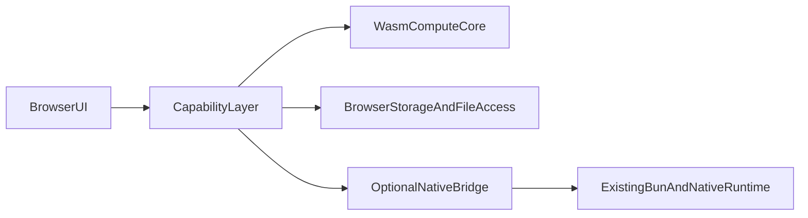

# Web-Native Feasibility

This document captures the current assessment of whether `oh-wiblo-pi` can be made web-native and what shape that work would realistically take.

## Short answer

`oh-wiblo-pi` can support a web-native experience, but not by lightly adapting the current app.

Today the repo is architecturally aligned with the Bun-first, terminal-first `oh-my-pi` model, not the browser-oriented `pi-mono` `web-ui` path. A credible browser target would need to be either:

1. a capability-gated browser subset, or
2. a browser UI backed by an optional native bridge or daemon.

It should be treated as a new runtime target and product surface, not a packaging exercise.

## Why the current app is not browser-native

### 1. Bun is on the critical path

The current runtime assumes Bun directly:

- `package.json` runs the workspace, checks, and development flows through `bun`
- `packages/coding-agent/src/cli.ts` uses `#!/usr/bin/env bun`, checks `Bun.version`, and relies on `Bun.JSONL.parseChunk` and `Bun.stringWidth`
- multiple runtime paths use `Bun.file`, `Bun.write`, `Bun.spawn`, `Bun.spawnSync`, `Bun.Glob`, `Bun.which`, and `Bun.serve`

This is not a browser-compatible runtime surface.

### 2. Native addons are central, not optional

`@oh-my-pi/pi-natives` is a Rust N-API addon layer, not a thin optional acceleration layer.

Relevant files:

- `packages/natives/package.json`
- `packages/natives/src/native.ts`
- `crates/pi-natives/Cargo.toml`

The addon currently exposes browser-incompatible or browser-divergent domains including:

- shell execution
- PTY sessions
- terminal and OS-specific clipboard integration
- process inspection
- projected filesystem helpers

Even the browser-safe compute features currently arrive through the same addon boundary.

Clipboard is a special case: the browser Clipboard API can closely replicate text copy and image paste in a secure, user-activated web app, but it does not provide full parity for terminal-specific paths such as OSC 52, Termux integration, or silent background clipboard access.

### 3. Shell and PTY execution are first-class features

The coding agent depends on native shell execution and terminal process control:

- `packages/coding-agent/src/exec/bash-executor.ts`
- `packages/coding-agent/src/tools/bash-interactive.ts`

These paths rely on `Shell`, `executeShell`, and `PtySession` from `@oh-my-pi/pi-natives`. Browsers do not expose a host PTY or a native process model.

### 4. Filesystem assumptions are pervasive

The current session, config, and artifact model assumes direct filesystem access:

- `packages/coding-agent/src/session/agent-session.ts`
- `packages/coding-agent/src/discovery/helpers.ts`
- `packages/coding-agent/src/extensibility/plugins/loader.ts`
- `packages/coding-agent/src/config/keybindings.ts`

This includes:

- local session files
- artifact directories
- project discovery
- plugin manifests
- user config under home-directory-based paths

That model must be redesigned for browser storage and permissioned file access.

### 5. The app shell is TUI-first

The current interaction model is built around the terminal UI stack:

- `packages/tui`
- `packages/coding-agent/src/modes/interactive-mode.ts`

This is a terminal renderer, not a DOM UI abstraction. It should not be treated as the starting point for a browser app.

### 6. Provider access becomes a browser security problem

The provider layer is currently server-style code that uses `fetch` plus local environment and filesystem assumptions:

- `packages/ai/src/stream.ts`
- `packages/ai/src/providers/*`

If the same logic moves into the browser, two problems appear immediately:

- CORS restrictions for LLM and search providers
- API key handling and client-side secret exposure

So even capabilities that look browser-friendly at first glance often still need a proxy, extension context, or bridge.

## What is already reusable

Not everything has to be rebuilt.

The most reusable parts are:

- the agent/session model in `packages/agent`
- the provider abstractions in `packages/ai`
- the high-level tool model in `packages/coding-agent/src/tools`
- the compute-oriented parts of `crates/pi-natives`
- some browser-facing patterns from `packages/stats`

The least reusable parts for a browser target are:

- the TUI layer
- native shell and PTY execution
- direct filesystem assumptions
- stdio or subprocess-oriented integrations

## Viable target architectures

### Option A: Pure browser subset

This is the smallest plausible web-native target.

The browser build would support:

- chat and session UI
- model selection and streaming responses
- read/analyze workflows
- browser storage
- optional File System Access API for user-granted files
- AST, grep, and BM25 features after a WASM port of the compute subset

It would not support full parity with the current CLI.

Expected exclusions or partials:

- no host shell
- no real PTY
- no local git execution
- no SSH
- no local LSP servers
- no stdio-based MCP servers without a bridge

### Option B: Browser UI plus local daemon

This is the path to near-parity.

The browser app owns:

- UI
- session state
- browser-safe storage and rendering
- browser-safe compute

The local daemon owns:

- shell
- PTY
- filesystem
- git
- SSH
- local LSP
- subprocess-backed MCP integrations

This preserves more of the existing system, but it is no longer a pure browser app. It is a split architecture with a browser frontend and a native companion.

## Capability matrix

| Capability | Pure browser subset | Browser + local daemon | Notes |
| --- | --- | --- | --- |
| Chat UI and streaming | Yes | Yes | New browser UI required |
| Session persistence | Yes | Yes | Browser storage or synced state |
| Read files | Partial | Yes | Pure browser path depends on user-granted file access |
| Write files | Partial | Yes | Browser writes require explicit grants |
| Grep / AST / BM25 | Yes, after WASM port | Yes | Compute subset is the best portability target |
| Bash / shell | No | Yes | Needs host process execution |
| PTY terminal | No | Yes | Browser terminal emulation is not host PTY parity |
| Git-heavy workflows | No | Yes | Depends on local process and filesystem access |
| SSH | No | Yes | Requires native bridge or remote relay |
| Local LSP | No | Yes | Needs native processes |
| MCP stdio servers | No | Yes | HTTP-based MCP may be bridged separately |
| Direct provider calls from browser | Partial | Yes | Pure browser path still needs CORS-safe auth strategy |

## Target-specific capability profiles

Capability gating should be driven by two layers:

1. the build target or deployment profile, which selects the default capability set
2. runtime probing, permissions, and environment checks, which determine what is actually usable

That means the system should not treat clipboard, file access, shell access, or similar features as globally on or off. It should derive them from the target and then refine them at runtime.

Examples:

- `terminal-native`: enables terminal-aware features such as OSC 52 clipboard behavior when running on a real TTY
- `termux`: enables Termux-specific clipboard integration
- `browser-page`: enables browser clipboard text and image flows only when secure-context, user-activation, and permission requirements are satisfied
- `browser-worker`: disables clipboard support entirely
- `browser-extension`: may enable broader clipboard support depending on extension permissions and browser behavior
- `browser-plus-daemon`: uses browser-native clipboard where possible and delegates native-only features to the companion runtime

This is especially important for clipboard behavior. Text copy and image paste are good candidates for browser-native implementations, while OSC 52, silent background access, and other terminal or OS-specific paths should remain target-specific capabilities rather than assumptions of the shared runtime.

## Recommended path

### Phase 1: Split portable and non-portable runtime surfaces

Before building any browser UI, identify which tool and session paths are:

- browser-safe
- browser-safe with adaptation
- native-only

The main seam should start around:

- `packages/coding-agent/src/sdk.ts`
- `packages/coding-agent/src/tools`
- `packages/coding-agent/src/session`

The goal is to stop treating Bun, native addons, and browser-safe compute as one indivisible runtime.

### Phase 2: Port only the compute subset to WASM

Do not try to port the full addon.

The first portability target should be the browser-safe subset of `pi-natives`, such as:

- glob-style matching
- in-memory grep and text operations
- AST search and rewrite
- BM25 or search-index logic
- syntax and document transforms that do not require OS primitives

Do not port in the first pass:

- PTY
- shell execution
- process inspection
- projected filesystem helpers
- terminal-specific clipboard plumbing

Browser-native clipboard support should be implemented separately with the Clipboard API for text copy and image paste, instead of trying to port the native clipboard path directly.

### Phase 3: Build a separate browser UI

Do not attempt to reuse the terminal UI as the browser app shell.

Instead, build a dedicated browser UI around:

- agent events
- tool lifecycle rendering
- browser storage
- capability-aware controls

`packages/stats` is useful as proof that the repo can already ship browser-facing code, but it is not a chat UI foundation.

### Phase 4: Add the daemon-backed mode only after the subset works

Once the pure-browser subset is working, add an optional bridge for parity features.

That bridge can progressively restore:

- shell
- PTY
- git operations
- local LSP
- SSH
- stdio-oriented MCP support

This keeps the first milestone useful without committing the browser effort to full native parity on day one.

## Non-goals

The following should be considered out of scope for the first browser milestone:

- porting the current TUI directly to the browser
- making the existing Bun CLI run unchanged in the browser
- achieving full shell parity without a native bridge
- storing provider API keys directly in page JavaScript as the default model

## Proposed high-level architecture

## Bottom line

`oh-wiblo-pi` can become web-native only if web-native means one of two things:

1. a browser-first subset with capability gating, or
2. a browser frontend backed by a native companion.

What it cannot realistically become is the current Bun-native, TUI-first, N-API-heavy application running mostly unchanged inside the browser. Nearly similar feature parity is achievable only when the browser is the UI layer and native-only capabilities remain behind a companion runtime.
